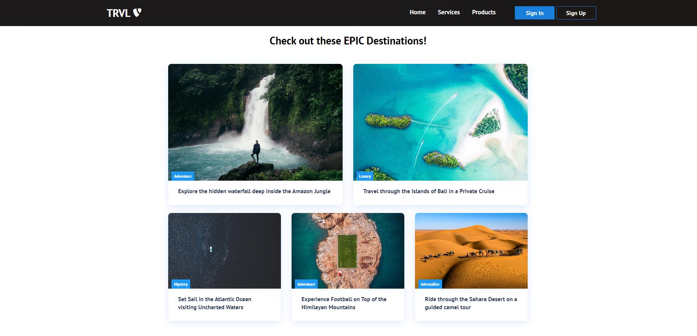
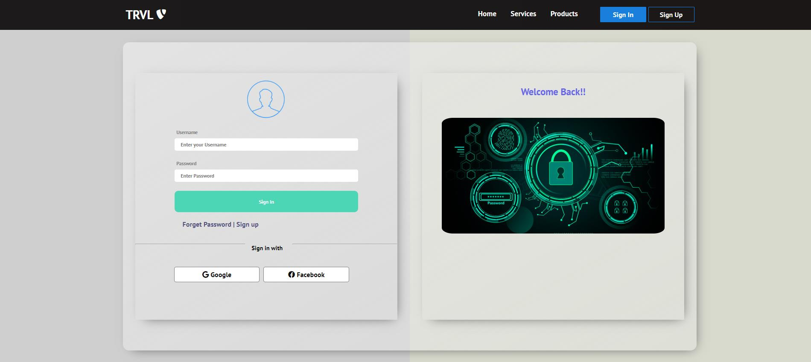

<b>Travel website provides travel reviews, trip fares, or a combination of both.

Over 1.5 billion people book travel per year, 70% of which is done online.

The Website look at where the user is going and pair them with other places they want to go based on where other people have gone.</b>

    
    
    

